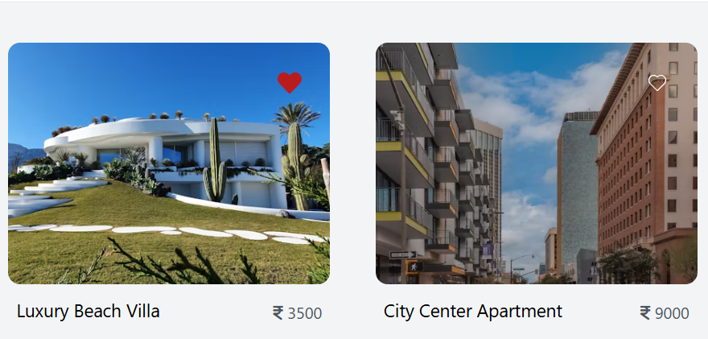
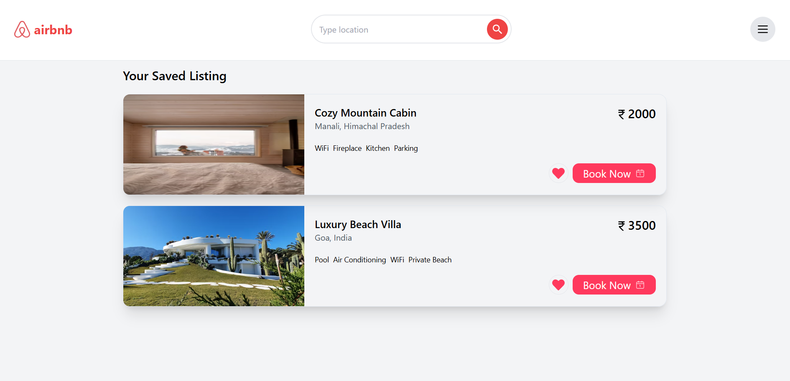
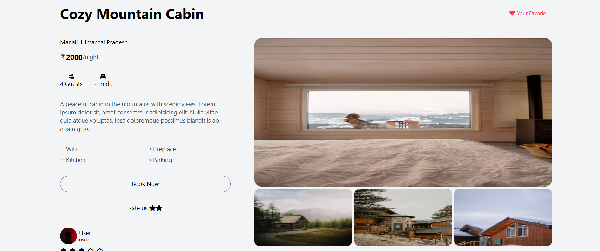
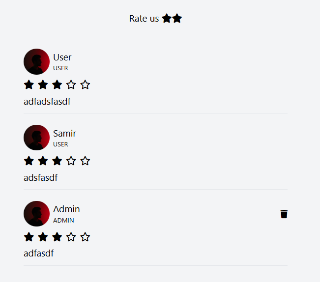
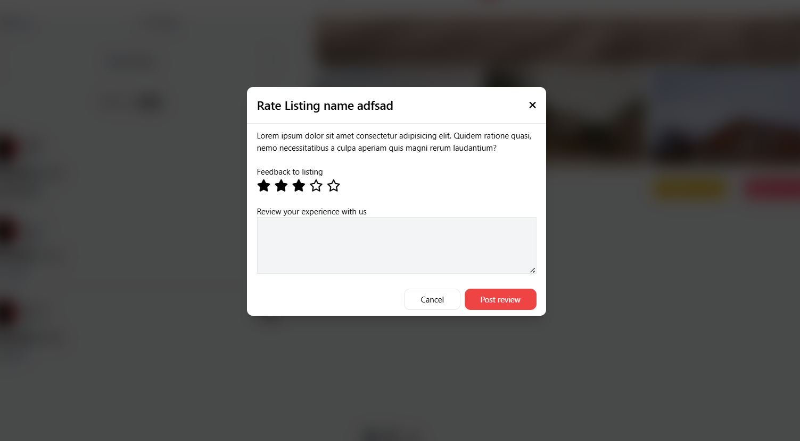
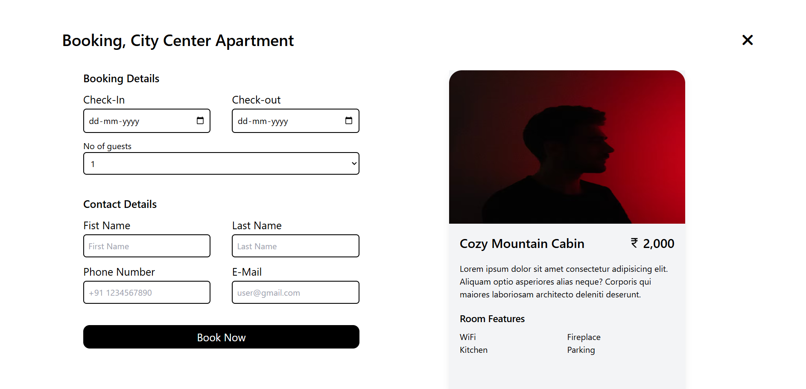
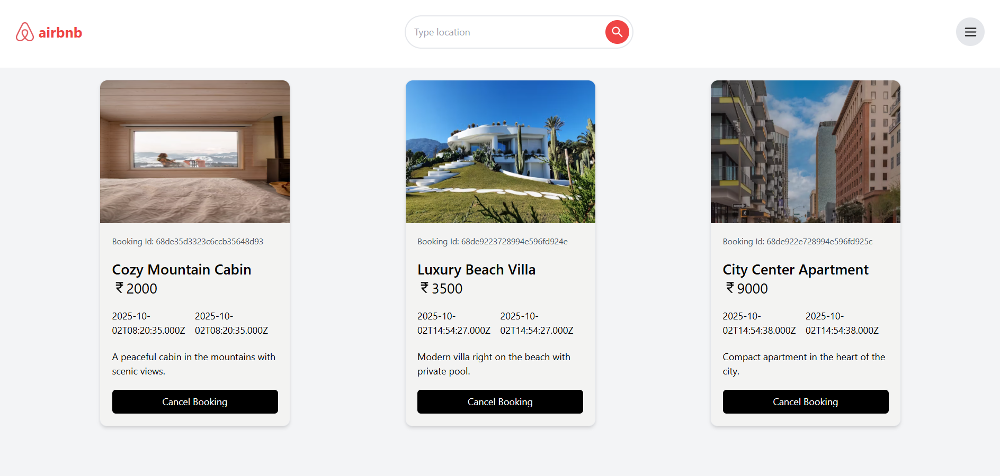
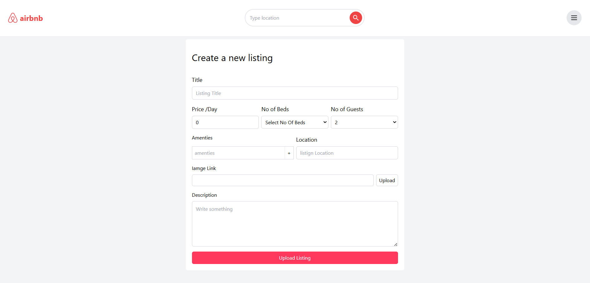

# AIRBNB 

## About the project

This project is an Airbnb-inspired platform.

- **Admin Control**:
  - Admin can manage the Upload listing,
  - Update Listing, Delete Listing, Cancel bookings, See bookings and user information.

- **User Control**:
  - User can SignIn, SignUp, Logout.
  - User can rate a listing with stars and comment and also can remove comments.
  - There is search option in navbar where user can search lisitn and location.
  - User can Like and Dislike the listing.
  - Like listing stored in localstorage.
  - User can book a listing with there information and a period of date from date to date with daily price.
  - User can cancel booking any time.

---

## 🌐 Live Demo
🔗 [View Live Project](https://airbnb-2-eram.onrender.com)

---

## Installation 

To set up the Airbnb on your local machine, follow these steps:

1. **Clone the Repository**:
    ```bash
    git clone https://github.com/warsi0707/AirBNB
    ```

2. **Install Dependecies**:
    ```bash
    npm install
    ```

3. **Run the Application**:
    ```
    node index.js
    ```

---

## Technologies Used

- **Frontend**:
  - React.js: For building the user interface.
  - React-Router: For navigation.
  - react-hot-toast: For pop-up status message.
  - Tailwind CSS: For styling components.


- **Backend**:
  - Node.js: For server-side logic.
  - Express.js: For building the RESTful API.

- **Database**:
  - Mongoose: For storing user and transaction data.

- **Authentication**:
  - JSON Web Tokens (JWT): For secure user authentication.

- **Others**:
  - Fetch: For making HTTP requests.
  - dotenv: For managing environment variables.
  - bcrypt: For password hashing.
  - cors: For connect backend and frontend
  - Cookies: For storing the token

---

## Screenshots

### Homepage


### Listing By Search


### Like and dislike listing


### Your Like listing


### Detail Listing


### Rate Your Favorite Listing



### Book Your Listing



### Upload Listing


### Signin


### Signup


