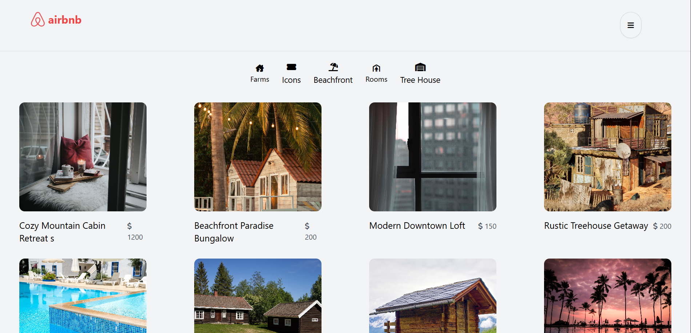

# AIRBNB 

## About the project

This project is an Airbnb-inspired platform.
- User can signup
- User can signin
- User can post there listing, and edit and delete it
- User can rate the listings with rating and some comment
- Also rating owner cand edit and delete there comments


## Installation 

To set up the Airbnb on your local machine, follow these steps:

1. **Clone the Repository**:
    ```bash
    git clone https://github.com/warsi0707/AirBNB
    ```

2. **Install Dependecies**:
    ```bash
    npm install
    ```

3. **Run the Application**:
    ```
    node index.js
    ```


## Technologies Used

- **Frontend**:
  - React.js: For building the user interface.
  - React-Router: For navigation.
  - react-hot-toast: For pop-up status message.
  - Tailwind CSS: For styling components.


- **Backend**:
  - Node.js: For server-side logic.
  - Express.js: For building the RESTful API.

- **Database**:
  - Mongoose: For storing user and transaction data.

- **Authentication**:
  - JSON Web Tokens (JWT): For secure user authentication.

- **Others**:
  - Fetch: For making HTTP requests.
  - dotenv: For managing environment variables.
  - bcrypt: For password hashing.
  - cors: For connect backend and frontend
  - Cookies: For storing the token


## Screenshots



